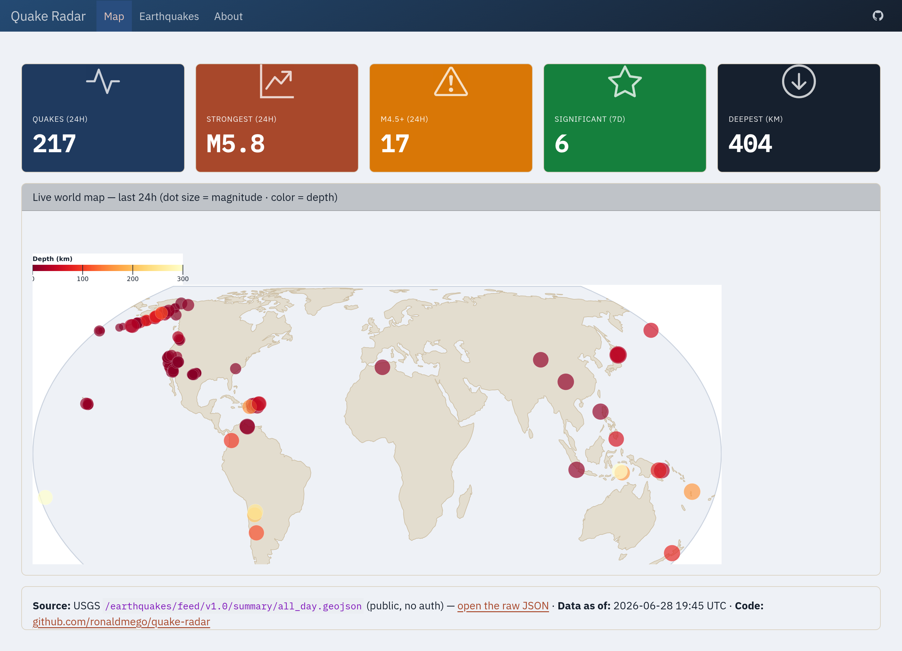

<p align="center">
  
</p>

<h1 align="center">Quake Radar</h1>

<p align="center">
  <strong>Archived snapshot</strong> — a world map of earthquakes from public USGS data, published straight from GitHub Actions with no server.
</p>

<p align="center">
  <a href="LICENSE"></a>
</p>

> **This project is archived and no longer live.** It used to publish to GitHub Pages and refresh
> every 30 minutes; the schedule and the published site have both been retired, so there is no live
> URL and nothing here updates anymore. The code stays public and read-only as a worked example of
> the pipeline described below — clone it and it still runs locally.
>
> For current earthquake information, go to the
> [USGS Earthquake Hazards Program](https://earthquake.usgs.gov/earthquakes/) or your national
> agency (e.g. **FUNVISIS** in Venezuela). This was never an official alert system.
>
> The same pipeline, still live and maintained:
> [**LLM Radar**](https://github.com/ronaldmego/llm-radar) ([live](https://ronaldmego.github.io/llm-radar)).

<p align="center">
  
</p>

## What it showed

- **World map** — every quake reported in the last 24h as a dot (size = magnitude, color = depth), with hover details.
- **At-a-glance stats** — quakes in 24h, strongest, M4.5+ count, significant in the last 7 days, deepest.
- **Tables** — most recent · strongest (24h) · significant (7d), each linking to the official USGS event page · plus a searchable catalog.
- **About** — the open methodology behind it, so anyone could audit, fork, or reuse the pipeline.

## How it worked

```
USGS GeoJSON API  →  Python (pandas + great-tables)  →  Quarto dashboard  →  GitHub Pages
        \____________ refreshed every 30 min by GitHub Actions (cron) ____________/
```

**Zero server, zero cost, no API key.** The USGS feeds are public, so a GitHub Actions cron
re-fetched the data, re-rendered the dashboard, and redeployed to GitHub Pages — no secrets, no
backend. Every number traced back to the exact public endpoint shown in the *Source* footer on each
page. That part is the reusable bit, and it still is: the same shape drives LLM Radar.

## Run locally

Still works. Requires [uv](https://docs.astral.sh/uv/) and [Quarto](https://quarto.org) 1.8+.

```bash
git clone https://github.com/ronaldmego/quake-radar.git
cd quake-radar
uv run quarto preview index.qmd
```

To check the data pipeline alone:

```bash
uv run python src/data_processor.py
```

## Data source

[USGS Earthquake Hazards Program](https://earthquake.usgs.gov/earthquakes/) — the public GeoJSON
summary feeds (`all_day`, `significant_week`). Public domain. Quake Radar was an independent project
and is not affiliated with the USGS.

## License

MIT — see [LICENSE](LICENSE).
